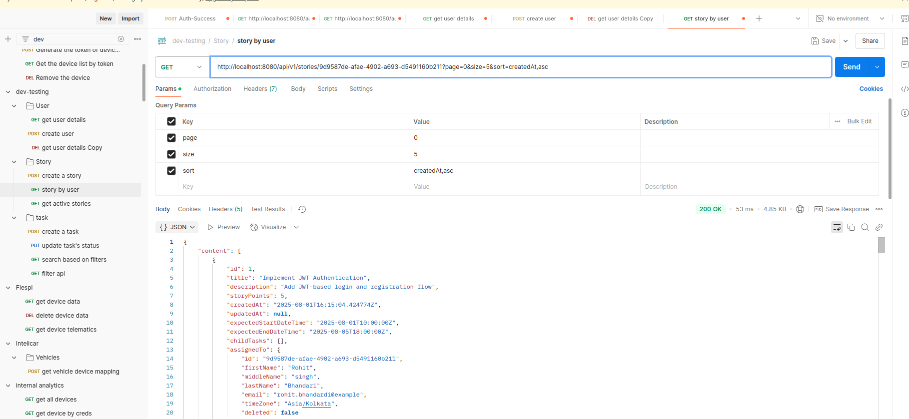

# Task Manager API

A Spring Boot application that provides APIs for managing tasks and stories, with caching, database persistence, and health monitoring.

## Tech Stack

- **Java 17**
- **Spring Boot**
- **PostgreSQL** (Docker container)
- **Redis** (Docker container)
- **Docker & Docker Compose**
- **Actuator** for health metrics
- **Spring Data JPA** with pagination
- **Global Exception Handling** for exceptions
- **JUnit 5** for testing

## Features

- RESTful APIs for task and story management

- Swagger UI

- Health and info endpoints exposed via `/actuator`


- Redis caching with TTL-based eviction (every 10 minutes)
- Time zone conversion support
- Pagination on list APIs
- Business logic testing with JUnit (e.g., progress calculation, filters, time zone)

## Repository

Clone the project from:

```bash
git clone https://github.com/rohit-nunam/task-manager.git
cd task-manager
```

## Running the Application (Dockerized)

Ensure Docker is installed and running.
From the project root directory, execute:

```docker-compose up --build```

This will:
Build the Spring Boot app.

Spin up:
- App container (exposed on port 8080) 
- PostgreSQL container (port 5432)
- Redis container (port 6379)

## Access the APIs
Once containers are up, the API is available at:

```http://localhost:8080/api/v1/**```

 





Actuator health check:

``` http://localhost:8080/actuator/health```

## Notes
- Cache eviction is scheduled every 10 minutes to clear stale Redis data.
- All exceptions are handled via a global exception handler.
- Database tables are auto-created via Spring JPA on startup.
- Docker volumes persist PostgreSQL data between restarts.